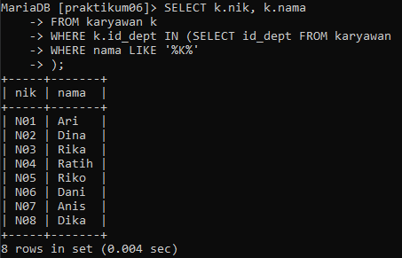

# Sub_Query

- Sub Query adalah suatu query yang menjadi bagian
dari suatu query.
- Sub Query digunakan untuk menangani masalah yang
kompleks yang mungkin sulit untuk dilakukan hanya
dengan sebuah query.
- Menyediakan cara alternatif untuk melakukan operasi
yangmembutuhkan join atau union yang rumit.
- Inner Query atau Sub Query akan menghasilkan suatu nilai
yang nantinya akan digunakan oleh Outer Query atau Main
Query sebagai temporari data.
- Subquery dapat ditempatkan dalam klausa SQL berikut:
    - FROM
    - WHERE
    - HAVING

## **TABLE DATA**

- Table **Departemen**
    ```sql
    SELECT * FROM departemen;
    ```
    <br>

- Table **Karyawan**
    ```sql
    SELECT * FROM karyawan;
    ```
    <br>

- Table **Perusahaan**
    ```sql
    SELECT * FROM perusahaan;
    ```
    <br>

- Table **Project**
    ```sql
    SELECT * FROM project;
    ```
    <br>

- Table **Project Detail**
    ```sql
    SELECT * FROM project_detail;
    ```
    <br>


## **LATIHAN**

1. Tampilkan data karyawan yang bekerja pada departemen yang sama dengan karyawan yang bernama Dika
    ```sql
    SELECT k.*
    FROM karyawan k
    WHERE k.id_dept = (SELECT id_dept FROM karyawan
    WHERE nama = 'Dika'
    );
    ```
    <br>


2. Tampilkan data karyawan yang gajinya lebih besar dari rata-rata gaji semua karyawan. urutkan menurun berdasarkan besaran gaji
    ```sql
    SELECT k.*
    FROM karyawan k
    WHERE k.gaji_pokok > (SELECT AVG(gaji_pokok) FROM karyawan)
    ORDER BY k.gaji_pokok DESC;
    ```
    <br>


3. Tampilkan nik dan nama karyawan untuk semua karyawan yang bekerja di department yang sama dengan karyawan dengan nama yang mengandung huruf 'K'.
    ```sql
    SELECT k.nik, k.nama
    FROM karyawan k
    WHERE k.id_dept IN (SELECT id_dept FROM karyawan
    WHERE nama LIKE '%K%'
    );
    ```
    <br>


4. Tampilkan data karyawan yang bekerja pada departemen yang ada di kantor pusat.
    ```sql
    SELECT k.*
    FROM karyawan k
    JOIN departemen d ON k.id_dept = d.id_dept
    WHERE d.id_p = (SELECT id_p FROM perusahaan
    WHERE nama = 'Kantor Pusat'
    );
    ```
    <br>


5. Tampilkan nik dan nama karyawan untuk semua karyawan yang bekerja di department yang sama dengan karyawan dengan nama yang mengandung huruf 'K' dan yang gajinya lebih besar dari rata-rata gaji semua karyawan
    ```sql
    SELECT k.nik, k.nama
    FROM karyawan k
    WHERE k.id_dept IN (SELECT id_dept FROM karyawan WHERE nama LIKE '%K%')
    AND k.gaji_pokok > (SELECT AVG(gaji_pokok)
    FROM karyawan
    );
    ```
    <br>

### **PENJELASAN**

1. Dalam query pertama, subquery `(SELECT id_dept FROM karyawan WHERE nama = 'Dika')` mengembalikan id departemen dari Dika. Nilai ini kemudian digunakan untuk menyaring query utama, yang memilih semua data dari tabel `karyawan` di mana kolom `id_dept` cocok dengan nilai subquery.

2. Dalam query kedua, subquery `(SELECT AVG(gaji_pokok) FROM karyawan)` mengembalikan rata-rata gaji semua karyawan. Nilai ini kemudian digunakan untuk menyaring query utama, yang memilih semua data dari tabel `karyawan` di mana kolom `gaji_pokok` lebih besar dari nilai subquery.

3. Dalam query ketiga, subquery `(SELECT id_dept FROM karyawan WHERE nama LIKE '%K%')` mengembalikan daftar id departemen dari karyawan yang namanya mengandung huruf ‘K’. Daftar ini kemudian digunakan untuk menyaring query utama, yang memilih kolom `nik` dan `nama` dari tabel `karyawan` di mana kolom `id_dept` ada dalam daftar subquery.

4. Dalam query keempat, tidak ada subquery di klausa WHERE, tetapi ada join antara tabel `karyawan` dan `departemen`. Kondisi join adalah bahwa kolom `id_dept` dari kedua tabel harus cocok. Subquery `(SELECT id_p FROM perusahaan WHERE nama = 'Kantor Pusat')` mengembalikan id perusahaan dari kantor pusat. Nilai ini kemudian digunakan untuk menyaring tabel yang digabung, yang memilih semua data dari tabel `karyawan` di mana kolom `id_p` dari tabel `departemen` cocok dengan nilai subquery.

5. Dalam query kelima, ada dua subquery di klausa WHERE, satu untuk menyaring berdasarkan departemen dan satu untuk menyaring berdasarkan gaji. Logikanya mirip dengan query sebelumnya, kecuali bahwa kedua kondisi harus benar agar baris dipilih.